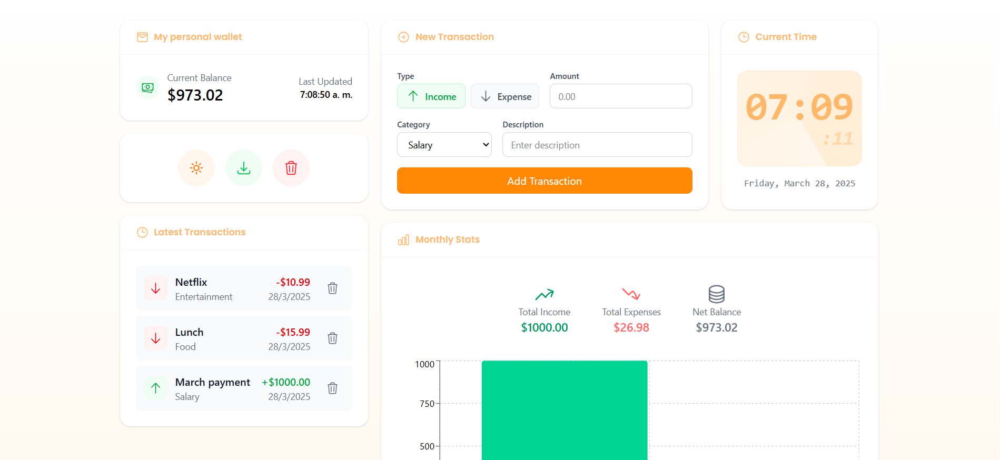

# Personal Wallet App

A modern, responsive personal wallet application built with React, TypeScript, and Redux Toolkit. This app helps you track your income and expenses with a clean, intuitive interface.



## Features

- 💰 **Transaction Management**

  - Add income and expenses
  - Categorize transactions
  - Delete individual transactions
  - Clear all transactions
  - Real-time balance updates
  - Export transactions to Excel

- 🎨 **Modern UI/UX**

  - Clean and intuitive interface
  - Dark mode support
  - Responsive design
  - Smooth transitions and animations
  - Digital clock with date display

- 📊 **Smart Features**

  - Transaction categorization
  - Monthly statistics with visual charts
  - Pagination for transaction history
  - Persistent storage using Redux Persist
  - Type-safe development with TypeScript

- 🌙 **Theme Support**

  - Light/Dark mode toggle
  - Persistent theme preference
  - Smooth theme transitions

- 📈 **Statistics and Reports**
  - Monthly income/expense overview
  - Visual transaction trends
  - Net balance tracking
  - Export data to Excel

## Tech Stack

- **Frontend Framework**: React with TypeScript
- **State Management**: Redux Toolkit
- **Styling**: Tailwind CSS
- **Icons**: Heroicons
- **Charts**: Recharts
- **Persistence**: Redux Persist
- **Type Safety**: TypeScript
- **Export**: XLSX

## Getting Started

### Prerequisites

- Node.js (v14 or higher)
- npm or yarn

### Installation

1. Clone the repository:

```bash
git clone https://github.com/samuelfs96/my-personal-wallet-app.git
```

2. Navigate to the project directory:

```bash
cd my-personal-wallet-app
```

3. Install dependencies:

```bash
npm install
# or
yarn install
```

4. Start the development server:

```bash
npm run dev
# or
yarn dev
```

5. Open your browser and visit `http://localhost:3000`

## Project Structure

```
src/
├── components/
│   ├── common/         # Reusable UI components
│   └── features/       # Feature-specific components
├── hooks/             # Custom React hooks
├── models/            # TypeScript interfaces and types
├── store/             # Redux store configuration
│   └── slices/        # Redux slices
└── App.tsx            # Main application component
```

## Links

- Live Site URL: [https://my-personal-wallet-app.netlify.app/](https://my-personal-wallet-app.netlify.app/)

## Author

- Website - [Samuel Figueroa](https://sfweb.netlify.app/)
